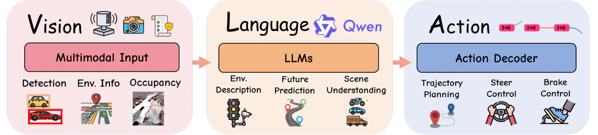
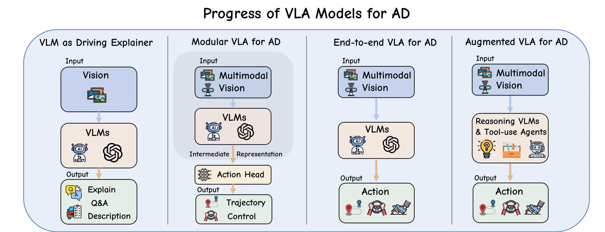

# Awesome Vision–Language–Action Models for Autonomous Driving 🚗

Welcome to **Awesome VLA4AD**—a curated, continuously updated collection of research papers and resources on Vision–Language–Action models for Autonomous Driving (VLA4AD). This repository tracks the latest advances in VLA4AD, from explanatory perception modules to end-to-end reasoning and control architectures.

Our latest survey is out [here](https://arxiv.org/abs/2506.24044)! We invite your feedback and discussion.

⭐️ **Follow & Star** to stay up to date!  
🤝 **Contributions welcome**—if you know of new papers, datasets, or tools, please open an issue or submit a PR.  
📬 **Questions or suggestions?** Reach us at **sicong.jiang@mail.mcgill.ca** or **qka23@mails.tsinghua.edu.cn**, welcome to talk with us!

---

## 📚 Table of Contents
- [🔥 Motivation & Paradigm Shift](#-overview-of-vla4ad)  
- [🚀 Overview of VLA4AD](#-overview-of-vla4ad)  
- [🏆 Awesome VLA4AD Papers](#-awesome-vla4ad-papers)  
  - [1️⃣ Pre-VLA: VLM as Explainers](#1-pre-vla-vlm-as-explainers)  
  - [2️⃣ Modular VLA4AD](#2-modular-vla4ad)  
  - [3️⃣ End-to-End VLA4AD](#3-end-to-end-vla4ad)  
  - [4️⃣ Reasoning-Augmented VLA4AD](#4-reasoning-augmented-vla4ad)  
- [📊 Datasets & Benchmarks](#-datasets--benchmarks)  
- [⚙️ Installation & Usage](#️-installation--usage)  
- [🤝 Contributing](#-contributing)  
- [⚖️ License](#️-license)  
- [📜 Citation](#-citation)

---
## 🔥 Motivation & Paradigm Shift

Recent advances have moved us from classic end-to-end driving pipelines toward interpretable, language-aware agents. The figure below contrasts three paradigms:

  
*Figure 1. From (a) conventional end-to-end AD, to (b) vision-language models as explainers, to (c) full Vision–Language–Action systems.*

---

## 🚀 Overview of VLA4AD

An illustration of the VLA4AD paradigm, contrasting conventional end-to-end autonomous driving, vision-language models for AD, and full Vision–Language–Action systems:

  
*Figure 2. Overview of Vision–Language–Action (VLA4AD) models for autonomous driving.*  

A snapshot of the field’s evolution through four successive stages—from VLM-as-explainer to augmented, reasoning-centric agents:

  
*Figure 3. Progression of VLA4AD models: (1) VLMs as passive explainers; (2) Modular VLA with intermediate representations; (3) End-to-end VLA mapping sensors directly to actions; (4) Augmented VLA with long-horizon reasoning and tool use.*

---


## 🏆 Awesome VLA4AD Papers

### 1️⃣ Pre-VLA: VLM as Explainers
| Model          | Year | Key Features                   | Link                                                             |
| -------------- | ---- | ---------------------- | ---------------------------------------------------------------- |
| DriveGPT-4     | 2023 | Scene Narration, QA    | https://arxiv.org/abs/2310.01412 / [Code](https://tonyxuqaq.github.io/projects/DriveGPT4/)|
| TS-VLM         | 2025 | Text-guided Attention  | https://arxiv.org/abs/2505.12670 / [Code](https://github.com/AiX-Lab-UWO/TS-VLM)|
| DynRsl-VLM     | 2025 | Adaptive Resolution    | https://arxiv.org/abs/2503.11265                                  |

### 2️⃣ Modular VLA4AD
| Model          | Year |  Key Features                      | Link                                                             |
| -------------- | ---- | ---------------------- | ---------------------------------------------------------------- |
| OpenDriveVLA   | 2025 | Language-guided Planning | https://arxiv.org/abs/2503.23463 / [Code](https://github.com/DriveVLA/OpenDriveVLA) |
| DriveMoE       | 2025 | Expert Routing         | https://arxiv.org/abs/2505.16278 / [Code](https://github.com/Thinklab-SJTU/DriveMoE) |
| LangCoop       | 2025 | V2V Coordination       | https://arxiv.org/abs/2504.13406 / [Code](https://github.com/taco-group/LangCoop)  |
| SafeAuto       | 2025 | Rule-based Safety      | https://arxiv.org/abs/2503.00211 / [Code](https://github.com/AI-secure/SafeAuto)  |
| RAG-Driver     | 2024 | Retrieval-Augmented   |https://arxiv.org/abs/2402.10828 / [Code](https://github.com/YuanJianhao508/RAG-Driver)|

### 3️⃣ End-to-End VLA4AD
| Model          | Year |  Key Features                      | Link                                                             |
| -------------- | ---- | ---------------------- | ---------------------------------------------------------------- |
| EMMA           | 2024 | Detection + Planning   | https://arxiv.org/abs/2403.04593 / [Code](https://github.com/taco-group/OpenEMMA)  |
| CoVLA-Agent    | 2024 | Caption + Trajectory   | https://arxiv.org/abs/2408.10845 / [Code](https://turingmotors.github.io/covla-ad/)     |
| ADriver-I      | 2023 | Diffusion-based World Model | https://arxiv.org/abs/2311.13549                                  |
| SimLingo       | 2025 | Action Dreaming        | https://arxiv.org/abs/2503.09594 / [Code](https://github.com/RenzKa/simlingo) |
| DiffVLA        | 2025 | Sparse-Dense Diffusion | https://arxiv.org/abs/2505.19381                                 |

### 4️⃣ Reasoning-Augmented VLA4AD
| Model          | Year |  Key Features                     | Link                                                             |
| -------------- | ---- | ---------------------- | ---------------------------------------------------------------- |
| ORION          | 2025 | Memory + Rationales    | https://arxiv.org/abs/2503.19755 / [Code](https://xiaomi-mlab.github.io/Orion/)              |
| Impromptu-VLA  | 2025 | CoT-Aligned Planning   | https://arxiv.org/abs/2505.23757 / [Code](https://github.com/ahydchh/Impromptu-VLA)           |
| AutoVLA        | 2025 | Drive Tokens + CoT     | https://arxiv.org/abs/2506.13757 / [Code](https://github.com/ucla-mobility/AutoVLA)           |

---

## 📊 Datasets & Benchmarks

| Name                   | Year | Modality                   | Task                      | URL                                       |
| ---------------------- | ---- | -------------------------- | ------------------------- | ----------------------------------------- |
| BDD100K / BDD-X        | 2018 | Video + Rationales         | Captioning, QA            | https://bdd-data.berkeley.edu/            |
| nuScenes               | 2020 | Camera, LiDAR, Radar       | Detection, QA             | https://www.nuscenes.org/                 |
| Bench2Drive            | 2024 | CARLA Simulator            | Closed-loop Driving       | https://github.com/OpenDriveLab/Bench2Drive |
| Reason2Drive           | 2024 | Video–QA                   | CoT-Chain Consistency     | https://github.com/…/Reason2Drive         |
| Impromptu-VLA Dataset  | 2025 | Video + QA + Traj          | Corner-Case Testing       |https://arxiv.org/abs/2505.23757|
| NuInteract              | 2025 | Multi-view QA              | 3D QA                     |https://arxiv.org/html/2505.08725v1|
| DriveAction            | 2025 | In-the-wild QA             | High-level Actions        |       https://arxiv.org/abs/2506.05667           |

---

## ⚙️ Installation & Usage

```bash
git clone https://github.com/JohnsonJiang1996/Awesome-VLA4AD.git
cd Awesome-VLA4AD
# Browse papers, datasets & code samples in each folder
```

---

## 📜 Citation

If this project is useful in your work, we'd appreciate a star 🌟 and a citation of our paper.
```
@article{jiang2025surveyvla,
  title={A Survey on Vision-Language-Action Models for Autonomous Driving}, 
  author={Jiang, Sicong and Huang, Zilin and Qian, Kangan and Luo, Ziang and Zhu, Tianze and Zhong, Yang and Tang, Yihong and Kong, Menglin and Wang, Yunlong and Jiao, Siwen and others},
  journal={https://arxiv.org/abs/2506.24044}, 
  year={2025}
}
```
